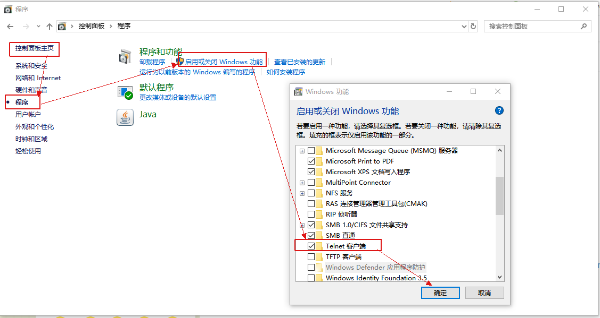

## netty 示例说明

### demo001
[示例参考](https://cloud.tencent.com/developer/article/1562150)

#### 测试步骤
1. 启动服务端，开启监听：`org.moonzhou.advancedprogramming.netty.demo001.NettyServer`
2. 启动客户端，模拟发起请求：`org.moonzhou.advancedprogramming.netty.demo001.NettyClient`
3. 或者启动一个终端，使用 [netcat](https://eternallybored.org/misc/netcat) 进行连接，本示例直接使用：`nc 127.0.0.1 6668`

#### 示例说明
1. Netty 抽象出两组线程池，`BossGroup` 专门负责接收客户端连接，`WorkerGroup` 专门负责网络读写操作。
1. `NioEventLoop` 表示一个不断循环执行处理任务的线程，每个 `NioEventLoop` 都有一个 `selector`，用于监听绑定在其上的 `socket` 网络通道。
1. `NioEventLoop` 内部采用串行化设计，从消息的`读取->解码->处理->编码->发送`，始终由 IO 线程 `NioEventLoop` 负责
   ```
    NioEventLoopGroup 下包含多个 NioEventLoop
    每个 NioEventLoop 中包含有一个 Selector，一个 taskQueue
    每个 NioEventLoop 的 Selector 上可以注册监听多个 NioChannel
    每个 NioChannel 只会绑定在唯一的 NioEventLoop 上
    每个 NioChannel 都绑定有一个自己的 ChannelPipeline
   ```

### demo002
采用的是 [官方示例](https://netty.io/wiki/user-guide-for-4.x.html) ，经过了些微的变动 [版本](https://blog.csdn.net/wocjy/article/details/78661464) 。
官方认为 `Hello World` 不是最简单的协议示例，而是 [DISCARD](https://tools.ietf.org/html/rfc863) 。

#### 测试步骤
1. 启动服务端：`org.moonzhou.advancedprogramming.netty.demo002.DiscardServer`
2. 通过终端，使用`netcat`连接： `nc localhost 8088`
1. 通过终端，使用`telnet`连接： `telnet localhost 8088`。需要注意的是windows下默认是关闭`telnet`，需要打开： `控制面板-程序-启动或关闭Windows功能-telnet`
   

#### 示例说明
1. 同`demo001`类似，服务端抽象两组线程池，boss(parentGroup)和worker(childGroup)。
1. boss的Channel配置，worker的Channel配置。
1. `ServerBootstrap`正常的配置(channel相关，端口等)启动和关闭。
1. 运行结果就是运行的控制台输出了客户端输入的内容。

### demo003
demo002中**DISCARD**只是接收了消息，但是没有任何的返回。该示例就是[ECHO](https://tools.ietf.org/html/rfc862)的一种实现。
[官方示例源码](https://netty.io/4.1/xref/io/netty/example/echo/package-summary.html)，初始化部分有些许微调。

#### 测试步骤
同`demo002`的测试步骤

#### 示例说明
1. 整体过程同`demo001`和`demo002`类似
1. 本示例的核心是`ECHO`的实现，即直接返回用户输入的内容到终端即可，主要是`ctx.write(in);`和`ctx.writeAndFlush(Unpooled.EMPTY_BUFFER)`。
1. `@Sharable` 标识这类的实例之间可以在 `channel` 里面共享


